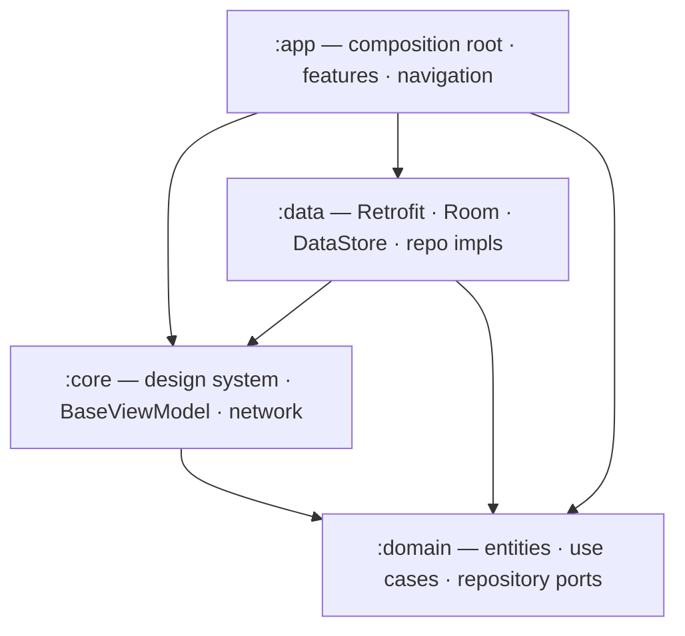
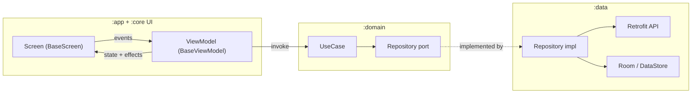

# Android Base Structure

Modern clone-to-start Android template using Kotlin, Jetpack Compose, Material 3,
MVVM + unidirectional data flow, Hilt, Retrofit, Room, DataStore, type-safe
Navigation Compose, and coding-agent project guidance.

Base package: `com.pbh.androidbase`.

## Contents

- [Quickstart](#quickstart)
- [Tech Stack](#tech-stack)
- [Architecture](#architecture)
- [Source Structure](#source-structure)
- [Reference Features](#reference-features)
- [Configuration](#configuration)
- [Theming](#theming)
- [Localization](#localization)
- [Testing And Coverage](#testing-and-coverage)
- [Common Tasks](#common-tasks)
- [Clone And Rename](#clone-and-rename)
- [Documentation And Agent Guidance](#documentation-and-agent-guidance)

## Quickstart

```bash
./gradlew :app:assembleDevDebug
./gradlew :app:installDevDebug
```

Mock login is enabled for the `dev` flavor. Use `demo@example.com` and `password`.

Android Studio also discovers shared Gradle run configurations from `.run/`.
Generate an Android App launch configuration locally for `devDebug` when you want
one-click deployment from the IDE.

## Tech Stack

| Area | Choice |
|---|---|
| Language/UI | Kotlin 2.2.21, Jetpack Compose BOM 2026.06.01, Material 3 |
| Android build | AGP 8.13.2, Gradle wrapper, compile/target SDK 36, min SDK 24 |
| Architecture | MVVM + UDF, sealed UI state, one-off effects |
| DI | Hilt 2.57.2 |
| Networking | Retrofit 3.0.0, OkHttp 5.4.0, kotlinx.serialization |
| Persistence | Room 2.8.4, Preferences DataStore 1.1.7, AndroidX Security |
| Navigation | Navigation Compose 2.9.8 with `@Serializable` routes |
| Quality | Spotless, ktlint, detekt, Kover |
| Tests | JUnit4, MockK, Turbine, coroutines-test, Robolectric, Compose UI test |

All versions live in `gradle/libs.versions.toml`.

## Architecture

### Module Graph

Each module depends only on the modules it points to (arrow = "depends on").
`:domain` sits at the center as pure Kotlin/JVM with no Android or framework code.



```text
:app -> :core, :data, :domain
:data -> :core, :domain
:core -> :domain
:domain -> Kotlin/JVM only
```

Feature code lives inside `:app` under
`com.pbh.androidbase.feature.{auth,home}`. Feature packages use `:domain` use
cases and shared `:core` UI, but must not import `com.pbh.androidbase.data.*`.
Data implementations stay in `:data`. The app module composes everything.

### Data Flow

The reference features follow the same vertical slice. Screens send events up and
render immutable state; use cases orchestrate domain behavior; repository ports in
`:domain` are implemented in `:data`.



### Layer Responsibilities

- `:domain` owns entities, repository interfaces, use cases, `AppResult`, and
  `DomainError`.
- `:core` owns shared UI primitives, theme tokens, `BaseViewModel`,
  `BaseScreen`, `UiText`, `DomainError.toUiText()`, dispatcher providers, and
  network helpers.
- `:data` owns Retrofit APIs, DTOs, Room entities/DAO/database, mappers,
  DataStore/session persistence, and repository implementations.
- `:app` owns `MainApplication`, `MainActivity`, root navigation, Hilt
  composition, feature packages, flavors, and app identity.

Feature ViewModels extend `BaseViewModel<S, E>` and expose immutable `state` plus
one-off `effects`. Screens render through `BaseScreen`, which collects
lifecycle-aware state, observes effects, and automatically shows
`MessageEffect` snackbars. UI states stay explicit and exhaustive with sealed
interfaces.

## Source Structure

Modules in dependency order (`:domain` → `:core` → `:data` → `:app`). Each
module's Kotlin lives under `src/main/kotlin/com/pbh/androidbase/`; test sources
mirror these packages under `src/test/kotlin`.

```text
com.pbh.androidbase
├── :domain
│     ├── entity
│     ├── model
│     ├── repository
│     └── usecase
├── :core
│     ├── common
│     ├── designsystem
│     ├── network
│     └── ui
├── :data
│     ├── local
│     ├── remote
│     ├── mapper
│     ├── repository
│     └── di
└── :app
    ├── feature
    │   ├── auth
    │   └── home
    ├── navigation
    └── di
```

| Module | Packages | Key types |
|---|---|---|
| `:domain` | `entity`, `model`, `repository`, `usecase` | `Item`, `UserSession`, `AppResult`, `DomainError`, `LoginUseCase` |
| `:core` | `common`, `designsystem`, `network`, `ui` | `BaseViewModel`, `BaseScreen`, `AppTheme`, `UiText`, `RetrofitFactory` |
| `:data` | `local`, `remote`, `mapper`, `repository`, `di` | `AppDatabase`, `ItemDao`, `SessionStore`, `AuthApi`/`ItemApi`, repository impls |
| `:app` | `feature/{auth,home}`, `navigation`, `di` | `MainActivity`, `AppNavHost`, `LoginViewModel`, `HomeViewModel` |

## Reference Features

- Authentication: login form, `LoginUseCase`, mock/real auth source selection,
  `SessionStore`, and session-driven navigation.
- Home: offline-first list/detail flow using Room as the local source of truth,
  remote refresh, dev-only seed fallback, and typed not-found errors.

Feature walkthroughs with Mermaid diagrams live in
[`docs/features/`](docs/features/README.md).

## Configuration

### Flavors And Environment

- `dev`: mock auth, seed fallback, local HTTP allowed for emulator hostnames.
- `staging`: real API URL placeholder, cleartext disabled.
- `prod`: real API URL placeholder, cleartext disabled.

Override the base URL in CI or local builds with:

```bash
./gradlew :app:assembleDevDebug -PANDROID_BASE_URL=https://example.test/
```

Or copy `.env.example` to `.env`, edit it, and export it before running Gradle:

```bash
set -a; source .env; set +a
./gradlew :app:assembleDevDebug
```

Gradle reads environment variables and `-P` properties; it does not auto-load
`.env` files.

### Signing

Release signing is isolated in `gradle/signing.gradle.kts` and applied from
`app/build.gradle.kts`. It is a no-op when `keystore.properties` is absent, so
debug and CI builds do not need secrets.

For release builds, copy `keystore.properties.example` to `keystore.properties`
and point `storeFile` at a local keystore. Never commit `keystore.properties`,
`*.jks`, or `*.keystore`.

## Theming

The app UI is controlled from `:core` through `AndroidBaseTheme` and
`AppThemeConfig`.

Configure:

- `colorScheme`: Material 3 light/dark color tokens.
- `typography`: Material 3 text styles used by screens and shared components.
- `shapes`: Material 3 shape tokens.
- `spacing`: app spacing tokens for screen padding, rows, and gaps.
- `decoration`: minimum touch target, loading indicator size/stroke, card
  elevation, and border width.

Feature screens should read `AppTheme.colors`, `AppTheme.typography`,
`AppTheme.spacing`, and `AppTheme.decoration` rather than hardcoding repeated
colors or dimensions. `MainActivity` selects `AppThemeDefaults.light()` or
`AppThemeDefaults.dark()` and passes the chosen config to `AndroidBaseTheme`.

## Localization

English is the primary locale. Every module that owns user-facing text keeps
matching keys in:

```text
src/main/res/values/strings.xml
src/main/res/values-vi/strings.xml
```

ViewModels expose messages as `UiText.Resource`; Composables resolve them with
`stringResource` or `UiText.asString`. Domain errors remain typed and are
translated through `DomainError.toUiText()` at the UI edge.

## Testing And Coverage

Kover is configured with an 80% line coverage gate for app logic that is
practical to test on the JVM: domain models/use cases, error mapping, `UiText`,
ViewModels, UI state, and one-off effects.

Use the dev-debug/module coverage command from [Common Tasks](#common-tasks). The
aggregate `koverVerify` task measures every Android variant and is not the
template's coverage gate.

CI runs on pushes to `main` and pull requests:

```text
./gradlew :app:assembleDevDebug
./gradlew testDevDebugUnitTest
./gradlew detekt spotlessCheck
./gradlew :app:koverVerifyDevDebug :data:koverVerifyDevDebug :core:koverVerifyDebug :domain:koverVerify
```

## Common Tasks

| Task | Command |
|---|---|
| Setup check | `./gradlew --version` |
| Build dev debug | `./gradlew :app:assembleDevDebug` |
| Install dev debug | `./gradlew :app:installDevDebug` |
| Unit tests | `./gradlew testDevDebugUnitTest` |
| Lint/format check | `./gradlew detekt spotlessCheck` |
| Format | `./gradlew spotlessApply` |
| Coverage gate | `./gradlew :app:koverVerifyDevDebug :data:koverVerifyDevDebug :core:koverVerifyDebug :domain:koverVerify` |
| Layer boundary check | `.agents/skills/and-dependency-injection/scripts/check_layer_boundaries.py` |

The thin `Makefile` wraps the same commands as `make setup`, `make build`,
`make test`, `make lint`, `make coverage`, `make format`, and `make init`.

## Clone And Rename

Use the init script after cloning the template into a new app:

```bash
./init_project.sh com.example.app "Example App"
```

The script rewrites the base package, app name text, and Kotlin package
directories under `app`, `core`, `data`, and `domain`.

## Documentation And Agent Guidance

- [Feature docs](docs/features/README.md) describe authentication, home, state,
  effects, workflows, and extension points.
- [Agent docs](docs/agents/domain.md) describe domain-layer conventions for
  coding agents.
- [Run configs](.run/README.md) explain the shared Android Studio Gradle
  configurations.
- `CONTEXT.md` defines the project vocabulary.
- `.agents/INDEX.md` maps common tasks to project skills.

Read `AGENTS.md`, `CONTEXT.md`, and `.agents/INDEX.md` before changing
architecture, dependencies, generated code, or feature boundaries.

Each `.agents/skills/*/SKILL.md` file is intentionally self-contained: open the
skill that matches the task, follow its checklist, and run its verification
commands before handing work back.

Hard rules:

- Do not hand-edit generated Hilt, Room, KSP, or `build/` output.
- Keep `:domain` Android-free.
- Keep feature packages independent from `com.pbh.androidbase.data.*`.
- Localize user-facing strings.
- Never commit secrets, signing keys, `local.properties`, `google-services.json`,
  or `.env` files other than `.env.example`.
