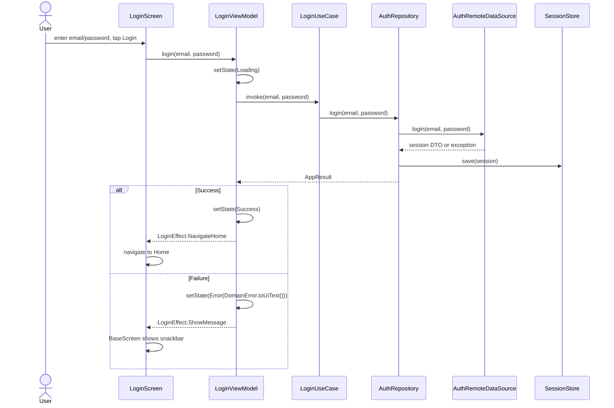

# Authentication

## Overview

The authentication feature renders the login form, delegates credentials to the
domain login use case, persists the resulting session through the data layer, and
navigates to home on success.

## Entry Points

- `app/src/main/kotlin/com/pbh/androidbase/feature/auth/navigation/AuthNavGraph.kt`
- `app/src/main/kotlin/com/pbh/androidbase/feature/auth/navigation/LoginRoute.kt`
- `app/src/main/kotlin/com/pbh/androidbase/feature/auth/ui/LoginScreen.kt`
- `app/src/main/kotlin/com/pbh/androidbase/feature/auth/ui/LoginViewModel.kt`
- `domain/src/main/kotlin/com/pbh/androidbase/domain/usecase/LoginUseCase.kt`
- `domain/src/main/kotlin/com/pbh/androidbase/domain/repository/AuthRepository.kt`
- `data/src/main/kotlin/com/pbh/androidbase/data/repository/AuthRepositoryImpl.kt`
- `data/src/main/kotlin/com/pbh/androidbase/data/remote/source/AuthRemoteDataSource.kt`
- `data/src/main/kotlin/com/pbh/androidbase/data/local/datastore/SessionStore.kt`

## Workflow

## State & Effects

`LoginUiState` is explicit: `Idle`, `Loading`, `Success`, or `Error(UiText)`.
`LoginEffect.NavigateHome` is handled by the screen callback, while
`LoginEffect.ShowMessage` implements `MessageEffect` and is displayed by
`BaseScreen`.

## Error Handling

`AuthRepositoryImpl` catches non-cancellation exceptions from the remote data source,
maps them with `NetworkErrorMapper`, and returns `AppResult.Failure`. The ViewModel
converts the typed `DomainError` to `UiText` with `toUiText()`.

## How To Extend

Add validation in `LoginUseCase` when the rule is domain-owned. Add presentation-only
field behavior in `LoginViewModel` or `LoginScreen`. Keep real network behavior behind
`AuthRemoteDataSource`; `DataModule` chooses mock or real auth from `BuildConfig.USE_MOCK`.
