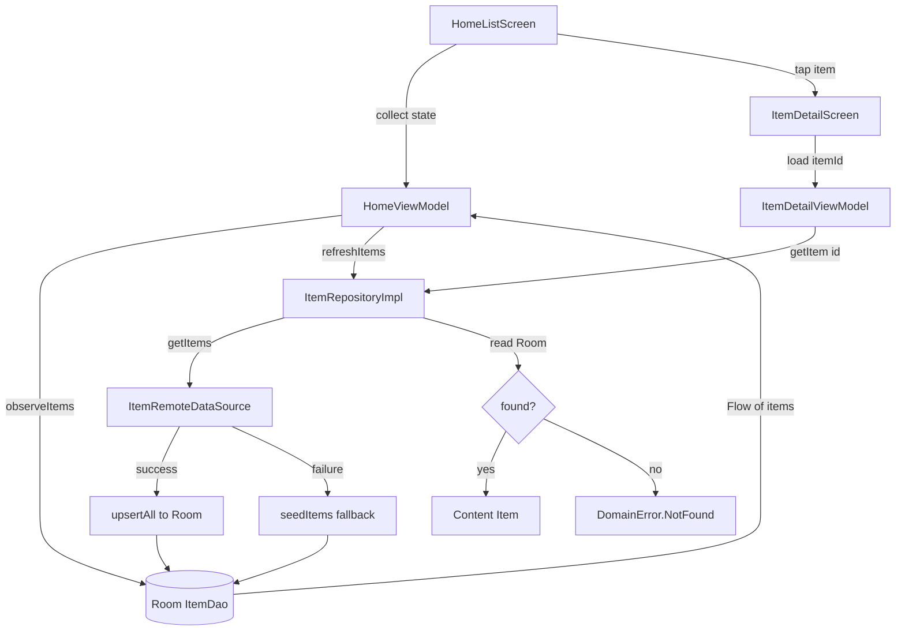

# Home

## Overview

The home feature is offline-first. The list screen observes cached Room data, starts
a refresh, stores remote results when available, and falls back to localized seed
items if the sample API is unavailable. The detail screen reads a single item from
Room and surfaces a typed not-found error when missing.

## Entry Points

- `app/src/main/kotlin/com/pbh/androidbase/feature/home/navigation/HomeNavGraph.kt`
- `app/src/main/kotlin/com/pbh/androidbase/feature/home/navigation/HomeRoutes.kt`
- `app/src/main/kotlin/com/pbh/androidbase/feature/home/ui/list/HomeListScreen.kt`
- `app/src/main/kotlin/com/pbh/androidbase/feature/home/ui/list/HomeViewModel.kt`
- `app/src/main/kotlin/com/pbh/androidbase/feature/home/ui/detail/ItemDetailScreen.kt`
- `app/src/main/kotlin/com/pbh/androidbase/feature/home/ui/detail/ItemDetailViewModel.kt`
- `domain/src/main/kotlin/com/pbh/androidbase/domain/usecase/GetItemsUseCase.kt`
- `domain/src/main/kotlin/com/pbh/androidbase/domain/usecase/RefreshItemsUseCase.kt`
- `domain/src/main/kotlin/com/pbh/androidbase/domain/usecase/GetItemDetailUseCase.kt`
- `data/src/main/kotlin/com/pbh/androidbase/data/repository/ItemRepositoryImpl.kt`
- `data/src/main/kotlin/com/pbh/androidbase/data/local/dao/ItemDao.kt`

## Workflow

## State & Effects

`HomeListUiState` starts in `Loading`, moves to `Content(items, refreshing)` as Room
emits data, and can represent `Error(UiText)` for list-level failures. Refresh
failures are emitted as `HomeListEffect.ShowMessage`; logout emits
`HomeListEffect.LoggedOut`.

`ItemDetailUiState` starts in `Loading`, then becomes `Content(Item)` or
`Error(UiText)` after `GetItemDetailUseCase` completes.

## Error Handling

`ItemRepositoryImpl.refreshItems()` retries with `seedItems()` when the remote source
throws a non-cancellation exception, then upserts the resulting DTOs into Room. If the
outer refresh still fails, the exception is mapped through `NetworkErrorMapper`.
`getItem(id)` returns `DomainError.NotFound` when Room has no matching row.

## How To Extend

Add list filters, sorting, or item actions in the domain use cases first when they
affect business behavior. Keep persistence and remote mapping in `:data`; feature
packages should continue depending on use cases and domain entities only.
